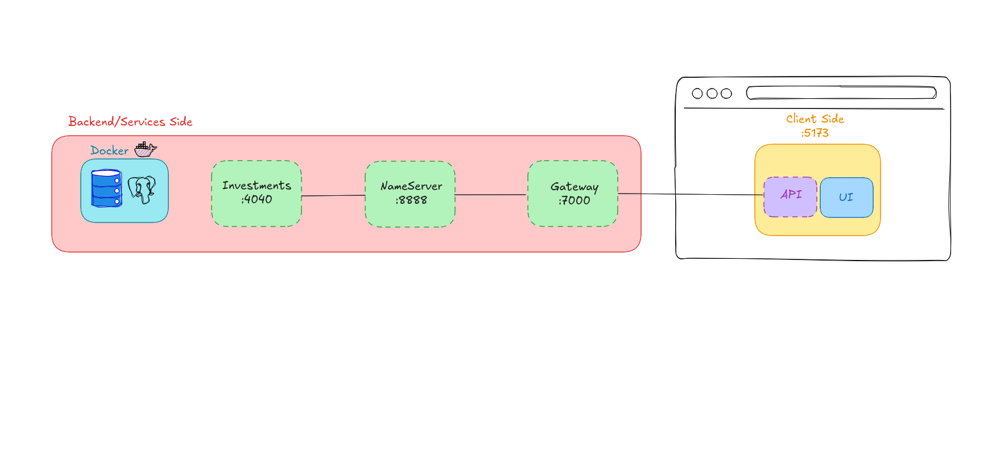

# 📈 StockDock

## 📝 Descrição

O **StockDock** é uma aplicação baseada em microserviços para gerenciamento de carteiras de investimentos.  
Permite que usuários criem e administrem múltiplas carteiras, cada uma com diferentes tipos de ativos como **Ações**, **Fundos Imobiliários (FII)** e **Criptomoedas**.  
O sistema centraliza dados, envia notificações relevantes e expõe APIs via Gateway.

---

## 🏗 Arquitetura

O projeto segue o padrão de microsserviços, com cada serviço responsável por uma função específica.   
A comunicação entre serviços ocorre via chamadas HTTP internas, com registro e descoberta de serviços pelo **Eureka Server**.  
O **API Gateway** centraliza o acesso, roteando e autenticando as requisições.

### Microsserviços

- **investments-service**:  Gerenciamento de carteiras e ativos
- **gateway**: Roteamento de requisições para o microsserviço
- **nameservice (Eureka)**: Registro e descoberta de serviços

### Modelo Arquitetural



### Estrutura de Pastas

```
Application/
  ├── Frontend/         # Aplicação React (interface do usuário)
  ├── Gateway/          # API Gateway (Spring Cloud Gateway)
  ├── Investments/      # Serviço de carteiras e ativos
  ├── NameServer/       # Eureka Server (service discovery)
  ├── User/             # Serviço de usuários
  ├── Wallet/           # Serviço de carteiras (pode ser legado ou complementar)
  └── docker-compose.yml
```

## 🛠 Tecnologias Utilizadas

### Backend

- **Java 17**
- **Spring Boot** (Web, Data JPA, Security)
- **Spring Cloud** (Eureka, Gateway)
- **PostgreSQL** (banco de dados)
- **Maven** (build e dependências)
- **Lombok** (boilerplate Java)

### Frontend

- **React.JS ** + **TypeScript**
- **Vite** (build e dev server)
- **React Router DOM**
- **CSS customizado**

### Infraestrutura

- **Docker** e **Docker Compose**
- **Eureka Server** (descoberta de serviços)
- **Volumes Docker** (persistência de dados)

---

## 🚀 Como Executar o Projeto

1. **Clone o repositório**
   ```bash
   git clone https://github.com/seu-usuario/StockDock.git
   cd StockDock/Application
   ```

2. **Suba os serviços com Docker Compose**
   ```bash
   docker-compose up --build
   ```

3. **Acesse o Frontend**
   - O frontend estará disponível em `http://localhost:5173` (ou porta configurada no Vite).

4. **APIs**
   - O acesso às APIs é feito via Gateway, normalmente em `http://localhost:8080`.

---

## 📚 Funcionalidades Principais

- Criação, edição e remoção de carteiras de investimentos;
- Adição e remoção de ativos (ações, FIIs, criptomoedas) em cada carteira;
- Visualização de saldo e composição das carteiras;
- Notificações automáticas sobre eventos relevantes;
- Interface web responsiva e intuitiva;

---

## 🤝 Contribuição

Contribuições são bem-vindas!  
Abra uma issue ou envie um pull request.

---

## 📄 Licença

Este projeto está sob a licença MIT.
